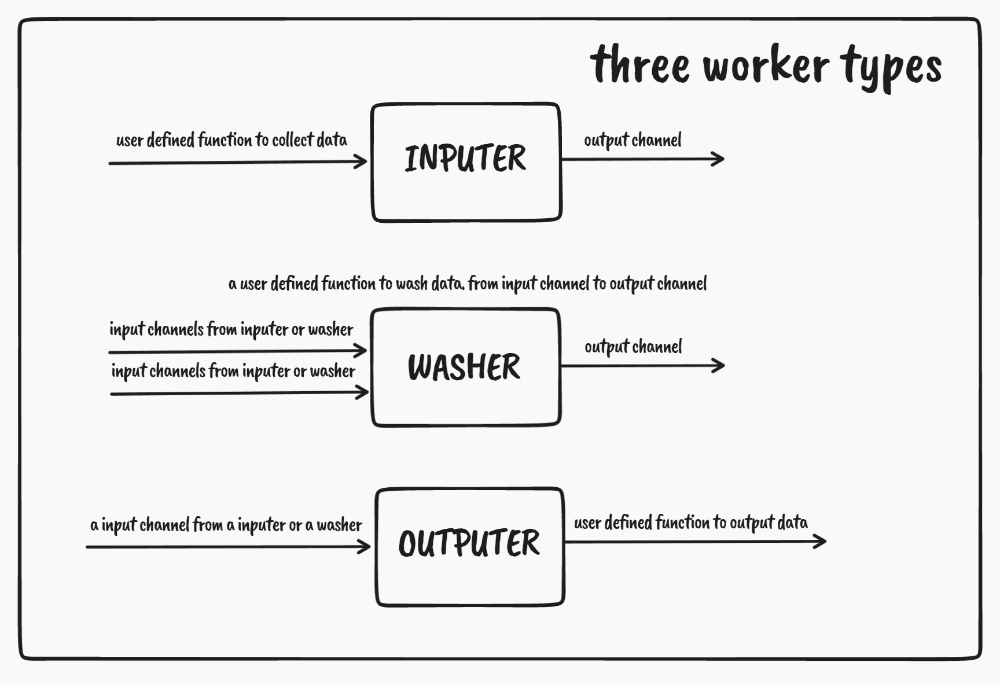
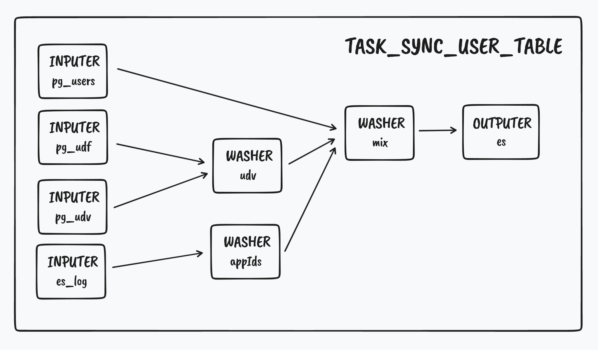

# gs
go task scheduler, can use to wash data.





### Example
the code of the picture above.
```
	taskUser := gs.NewTask(chanLength, "syncUser")
	taskUser.UseInputer("pq_users", inputer.GetUsersInputer)
	taskUser.UseInputer("pq_user_defined_fields", inputer.GetUserDefinedFieldsInputer)
	taskUser.UseInputer("pq_user_defined_field_value", inputer.GetUserDefinedFieldValueInputer)
	taskUser.UseInputer("es_user_actions", inputer.GetUserActionInputer)
	taskUser.UseWasher("appIds", washer.WashLoginAppIds, []string{"es_user_actions"})
	taskUser.UseWasher("udv", washer.WashUserWithUdf, []string{"pq_user_defined_fields", "pq_user_defined_field_value"})
	taskUser.UseWasher("mix", washer.WashToFullUser, []string{"appIds", "udv", "pq_users"})
	taskUser.UseOutputer("toEs", outputer.ToEsUserTableOutputer, "mix")
	taskUser.Run()
```
